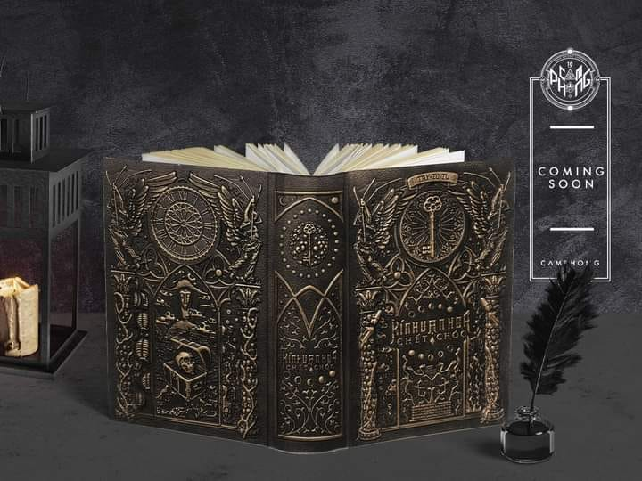
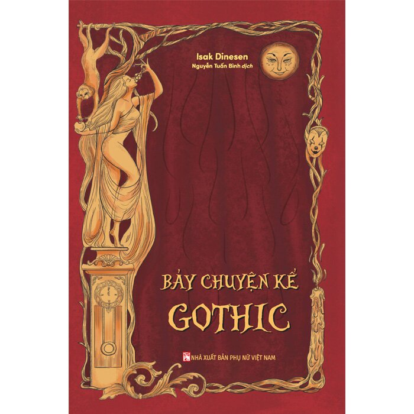
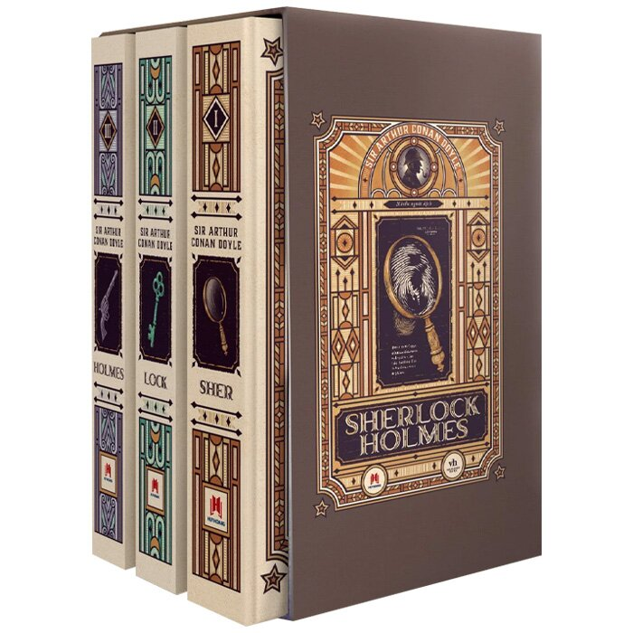
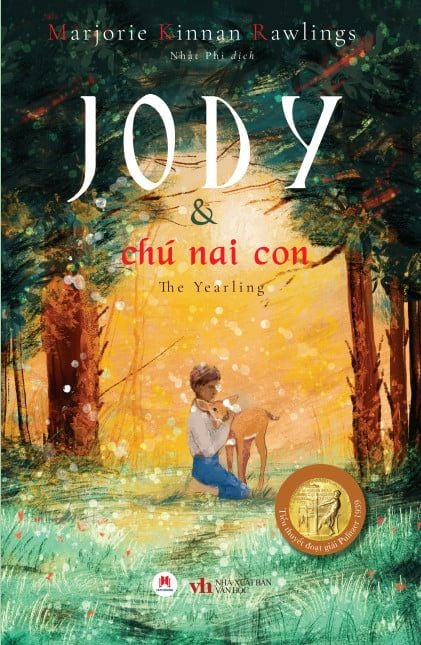

<html>

<head>
<meta http-equiv="Content-Language" content="vi">
<meta http-equiv="Content-Type" content="text/html; charset=windows-1258">
<title>Ngõ sách-Blog</title>
</head>

<body>

Ma Đ&#7841;o T&#7893; Sư

Tác gi&#7843;: M&#7863;c Hương Đ&#7891;ng Kh&#7913;u

Ng&#7909;y Vô Ti&#7879;n, ngư&#7901;i sáng l&#7853;p Ma đ&#7841;o, b&#7883; gi&#7899;i tu chân truy sát, đư&#7907;c tri&#7879;u h&#7891;i 
sau 13 năm đ&#7875; cùng Lam Vong Cơ khám phá bí &#7849;n cái ch&#7871;t c&#7911;a m&igrave;nh. C&#7889;t truy&#7879;n đan 
xen hi&#7879;n t&#7841;i và quá kh&#7913;, k&#7871;t h&#7907;p tiên hi&#7879;p, bí &#7849;n, và t&igrave;nh yêu bi thương, sâu 
s&#7855;c gi&#7919;a hai nhân v&#7853;t chính.

Kính V&#7841;n Hoa Ch&#7871;t Chóc

Tác 
gi&#7843;: Tây T&#7917; T&#7921;

Lâm Thu Th&#7841;ch bư&#7899;c vào tr&ograve; chơi sinh t&#7917; qua 12 cánh c&#7917;a s&#7855;t, nơi ph&#7843;i t&igrave;m ch&igrave;a 
khóa đ&#7875; s&#7889;ng sót. G&#7863;p Nguy&#7877;n Nam Chúc, m&#7897;t ngư&#7901;i gi&#7843; gái tài năng, c&#7843; hai cùng 
vư&#7907;t qua các th&#7871; gi&#7899;i nguy hi&#7875;m, khám phá bí &#7849;n và t&igrave;nh c&#7843;m n&#7843;y n&#7903; gi&#7919;a l&ograve;ng 
hi&#7875;m nguy.

&nbsp;

B&#7843;y Chuy&#7879;n K&#7875; Gothic

&nbsp;Tác 
gi&#7843;: Isak Dinesen

B&#7843;y truy&#7879;n ng&#7855;n đ&#7863;t trong châu Âu th&#7871; k&#7927; 19, k&#7871;t h&#7907;p l&atilde;ng m&#7841;n, siêu nhiên và 
châm bi&#7871;m. T&#7915; hành tr&igrave;nh t&igrave;m &yacute; ngh&#297;a cu&#7897;c đ&#7901;i c&#7911;a Augustus đ&#7871;n bi k&#7883;ch c&#7911;a nhà 
thơ Anders, các câu chuy&#7879;n khám phá s&#7889; ph&#7853;n, t&igrave;nh yêu và s&#7921; k&#7923; bí.

&nbsp;

Truy&#7879;n C&#7893; Grimm

Tác gi&#7843;: Jacob &amp; Wilhelm Grimm

B&#7897; 
sưu t&#7853;p 215 truy&#7879;n c&#7893; tích, t&#7915; “Cô bé L&#7885; Lem” đ&#7871;n “Nàng B&#7841;ch Tuy&#7871;t”, mang thông 
đi&#7879;p giáo d&#7909;c sâu s&#7855;c. Kèm 184 minh h&#7885;a sinh đ&#7897;ng, tác ph&#7849;m là di s&#7843;n văn hóa 
th&#7871; gi&#7899;i, g&#7907;i nh&#7899; tu&#7893;i thơ và giá tr&#7883; nhân văn.

&nbsp;

Sherlock Holmes

Tác gi&#7843;: Arthur Conan Doyle

Các v&#7909; án ly k&#7923; c&#7911;a thám t&#7917; Sherlock Holmes và bác s&#297; Watson, v&#7899;i suy lu&#7853;n s&#7855;c 
bén gi&#7843;i m&atilde; bí &#7849;n. T&#7915; “Chi&#7871;c nh&#7851;n t&igrave;nh c&#7901;” đ&#7871;n “Con chó săn c&#7911;a d&ograve;ng h&#7885; 
Baskerville”, m&#7895;i câu chuy&#7879;n là m&#7897;t hành tr&igrave;nh trí tu&#7879; đ&#7847;y h&#7845;p d&#7851;n.

&nbsp;

Cu&#7889;n Theo Chi&#7873;u Gió

Tác gi&#7843;: Margaret Mitchell

Scarlett O’Hara, cô gái m&#7841;nh m&#7869;, vư&#7907;t qua chi&#7871;n tranh và m&#7845;t mát &#7903; mi&#7873;n Nam nư&#7899;c 
M&#7929;. T&igrave;nh yêu trái ngang v&#7899;i Rhett Butler, cùng hành tr&igrave;nh trư&#7903;ng thành t&#7915; ích k&#7927; 
đ&#7871;n kiên cư&#7901;ng, k&#7871;t thúc m&#7903; đ&#7847;y hy v&#7885;ng.

&nbsp;

Jody và Chú Nai Con

Tác gi&#7843;: Marjorie Kinnan Rawlings

Gia đ&igrave;nh Baxter s&#7889;ng t&#7921; cung t&#7921; c&#7845;p &#7903; Florida hoang d&atilde;, đ&#7889;i m&#7863;t thú hoang và 
thiên nhiên kh&#7855;c nghi&#7879;t. Tác ph&#7849;m kh&#7855;c h&#7885;a t&igrave;nh yêu thiên nhiên, s&#7921; kiên tr&igrave; và 
giá tr&#7883; nhân văn qua hành tr&igrave;nh trư&#7903;ng thành c&#7911;a Jody.

&nbsp;

B&#7843;y K&#7867; Khùng Điên

Tác 
gi&#7843;: Roberto Arlt)

B&#7843;y nhân v&#7853;t l&#7853;p d&#7883;, t&#7915; k&#7867; phát minh hoa h&#7891;ng kim lo&#7841;i đ&#7871;n Nhà Chiêm Tinh, theo 
đu&#7893;i l&yacute; tư&#7903;ng gi&#7919;a x&atilde; h&#7897;i hi&#7879;n đ&#7841;i. Tác ph&#7849;m ch&#7845;t v&#7845;n ranh gi&#7899;i t&#7881;nh-điên, khám 
phá nhân tính và tr&#7853;t t&#7921; x&atilde; h&#7897;i phương Tây.

&nbsp;

Ai &#7902; Trong Gương

Tác gi&#7843;: Patrick Rangsimant

M&#7897;t chàng trai cô đ&#7897;c phát hi&#7879;n chi&#7871;c gương k&#7923; l&#7841;, giao ti&#7871;p v&#7899;i ngư&#7901;i bí &#7849;n t&#7915; 
th&#7871; gi&#7899;i khác. Tác ph&#7849;m BL Thái Lan k&#7871;t h&#7907;p huy&#7873;n bí và tâm l&yacute;, khám phá t&igrave;nh 
yêu vư&#7907;t ranh gi&#7899;i và hành tr&igrave;nh t&igrave;m b&#7843;n ng&atilde;.

&nbsp;

H&#7891; Đi&#7879;p và K&igrave;nh Ngư

Tác 
gi&#7843;: Tu&#7871; Ki&#7871;n

H&#7891; 
Đi&#7879;p, v&#7853;n đ&#7897;ng viên trư&#7907;t băng m&#7855;c ung thư, g&#7863;p Kinh Du, v&#7853;n đ&#7897;ng viên bơi l&#7897;i 
gi&#7843;i ngh&#7879;. T&igrave;nh b&#7841;n hay t&igrave;nh yêu c&#7911;a h&#7885; n&#7843;y n&#7903; gi&#7919;a đau kh&#7893;, k&#7871;t thúc bi thương 
nhưng đ&#7847;y &yacute; ngh&#297;a v&#7873; s&#7921; c&#7913;u r&#7895;i.

&nbsp;

&nbsp;

</body>

</html>
